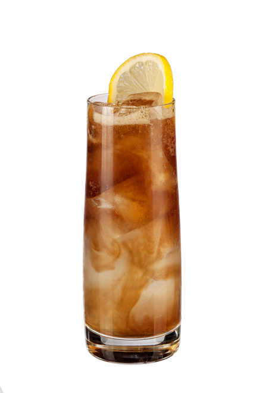

# Drink Name Here

## Rating: ★★★★☆
## Difficulty: ★★★☆☆

 

 

---

### Ingredients:

* 0.5oz Vodka
* 0.5oz Gin
* 0.5oz Light Rum
* 0.5oz Blanco Tequila
* 0.5oz Triple Sec / Cointreau
* 0.75oz Lemon Juice
* 0.75oz Simple Syrup
* Coca-Cola
##
* *(Garnish)* Lemon Flag / Wedge
* *(Ice)* Cubed / Crushed
* *(Glass)* Highball

---

### Directions:
1. Shake all ingredients except Coca-Cola with ice
2. Strain into ice-filled glass
3. Top with Coca-Cola
4. Garnish with lemon flag / wedge
5. Stir gently and serve
---

#### Notes:
> A lot of ingredients but comes together to make something tall and refreshing with a pretty good kick to it. The tequila comes through stronger than the rest in my experience but it's a good drink to have on a hot day. Can also alter the level of coke to make it stronger or weaker depending on your preference.

---

### Source:
* [Educated Barfly Youtube](https://www.youtube.com/watch?v=oe_AuNM_rPY)