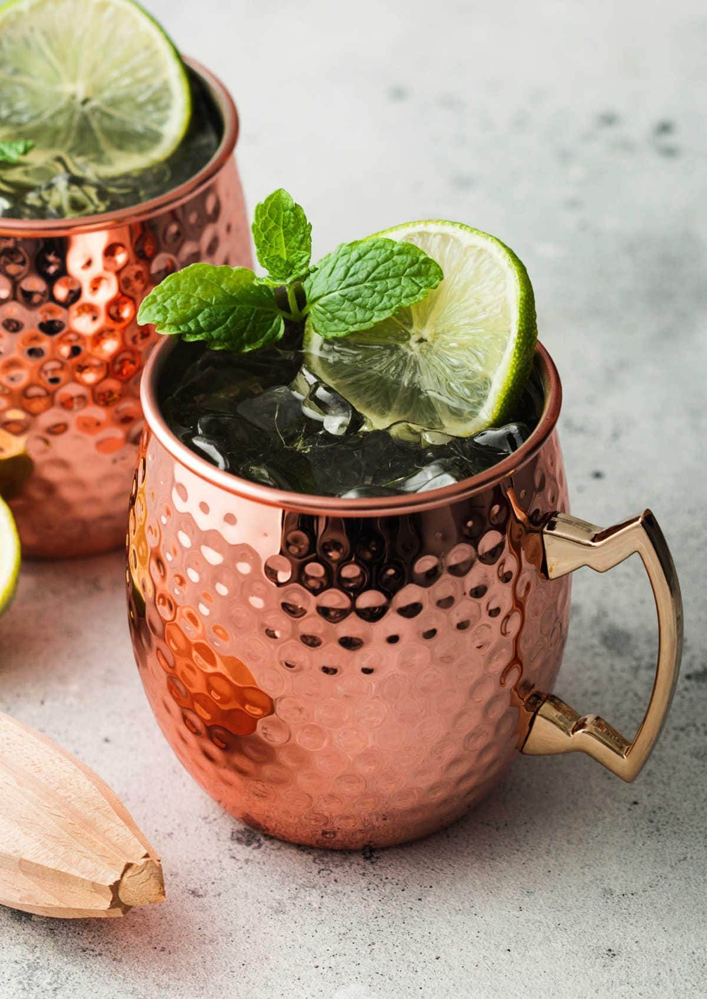

# Mule

## Rating: ★★★★☆

 

 

---

### Ingredients:

* 2oz **Liqour**
    * Vodka for Moscow Mule
    * Gin for London Mule
    * Bourbon for Kentucky Mule
    * Tequila for Mexican Mule
* 0.75oz Fresh **Lime Juice**
* **Ginger Beer**
* *(Garnish)* Lime Wedge/Mint/Candied Ginger

---

### Directions:
1. Fill copper mug 3/4 full with ice
2. Add liqour and lime juice
3. Top with ginger beer
4. Stir and garnish with lime wedge, mint, or candied ginger
---

#### Notes:
> I'm a huge fan of mules especially london mules! It is really easy to make and fun to drink and doesn't have a strong taste of liqour. Fresh lime juice and a good ginger beer really go a long way. It's interesting how having bottom shelf liqour and top shelf ginger beer and lime juice can really show how important the non-liqour ingredients are, especially here. Garnish mint for a refreshing drink and candied ginger for a sweeter drink. Straw's are nice for copper mugs as well.

---

### Source:
* [Liquor.com](https://www.liquor.com/recipes/moscow-mule/)
