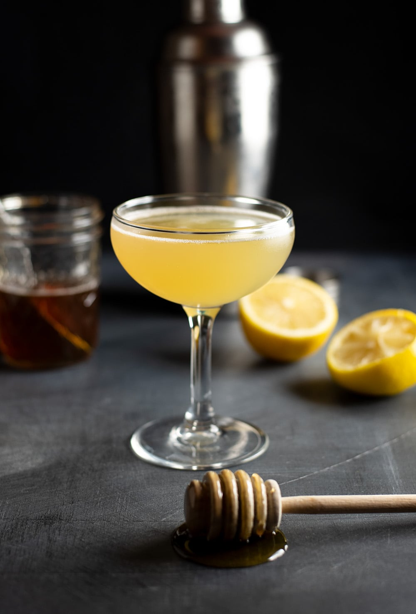

# Bee's Knees

## Rating: ★★★★★
## Difficulty: ★★☆☆☆

 

 

---

### Ingredients:

* 1.5oz Gin
* 0.75oz Lemon Juice
* 0.75oz Honey Syrup
##
* *(Garnish)* Lemon Twist or No Garnish
* *(Ice)* None
* *(Glass)* Coupe, Nick & Nora, or Martini

---

### Directions:
1. Shake all ingredients with ice
2. Strain into a chilled glass
3. Garnish with a lemon twist or no garnish
---

#### Notes:
> This has got to be one of my absolute favorite drinks. It's small so it doesn't overstay its welcome, it has this amazing combination of flavors that is so simple yet so delicous, and its super easy to make! Can't recommend this drink enough especially for those who are new to cocktails.

---

### Source:
* *I'm Just Here for the Drinks* by Sother Teague (Page 51)