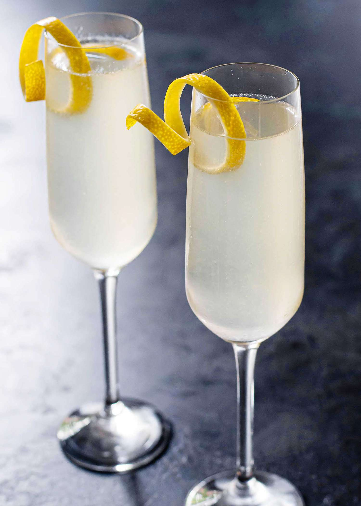

# French 75

## Rating: ★★★★☆
## Difficulty: ★★☆☆☆

 

 

---

### Ingredients:

* 1oz Gin
* 0.5oz Lemon Juice
* 0.5oz Simple Syrup
* 3oz Champagne
##
* *(Garnish)* Lemon Twist
* *(Ice)* None
* *(Glass)* Champagne Flute

---

### Directions:
1. Add gin, lemon, and simple to a shaker and shake until chilled
2. strain into glass
3. add champagne
4. garnish with lemon twist
---

#### Notes:
> I mean it's a champagne drink so i'm already not loving it but the gin and other ingredients save the day. It all manages to come together in a cohesive drink that I could sip for a while but I also won't be running out to get more champagne to drink more of these.

---

### Source:
* [Liquor.com](https://www.liquor.com/recipes/french-75-2/)