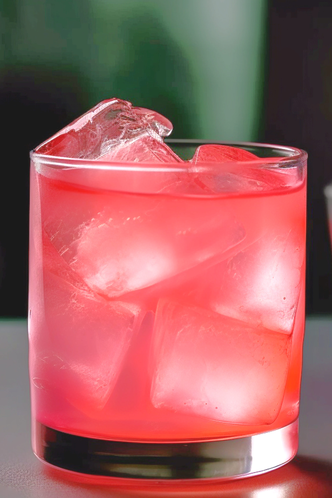

# Gin Daisy

## Rating: ★★★★☆
## Difficulty: ★★☆☆☆

 

 

---

### Ingredients:

* 2oz Gin
* 0.75oz Lemon Juice
* 0.75oz Orange Liqueur (Cointreau)
* 1tsp Grenadine
* Club Soda

##
* *(Garnish)* Lemon Wheel
* *(Ice)* Cube
* *(Glass)* Old Fashioned

---

### Directions:
1. Add all ingredients except club soda to shaker
2. Shake and strain into glass
3. Top with club soda and garnish
---

#### Notes:
> Has a lot of different variations but I like the variation with grenadine the best. It was great to sip the whole way through and while it's not my favorite drink its a strong option for a gin cocktail.

---

### Source:
* [Wine Enthusiast](https://www.winemag.com/recipe/gin-daisy/)