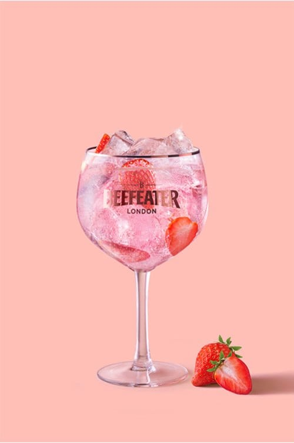

# Pink & Tonic

## Rating: ★★★★☆
## Difficulty: ☆☆☆☆☆

 

 

---

### Ingredients:

* 2oz Beefeater Pink Gin
* 4-6oz Tonic Water
* Fresh Strawberries
##
* *(Garnish)* Strawberry
* *(Ice)* Crushed
* *(Glass)* Not Specified

---

### Directions:
1. Add gin and tonic to a glass with ice and cut strawberries.
2. Stir to combine.
3. Garnish with strawberry
---

#### Notes:
> Yeah its a strawberry gin and tonic, if you like gin and tonic and strawberry you will enjoy this drink. The better the strawberry and the better the tonic water the better the drink so get quality ingredients and you will be rewarded.

---

### Source:
* [Beefeater London](https://www.beefeatergin.com/en-US/cocktails/pink-gin-tonic)