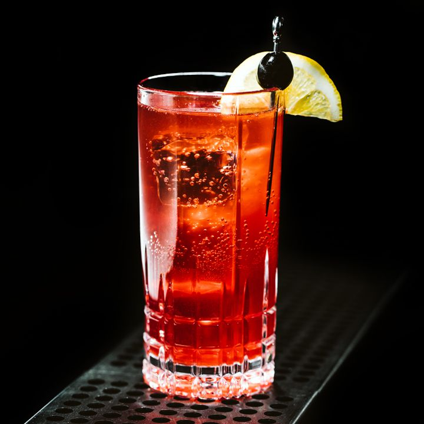

# Sloe Gin Fizz

## Rating: ★★★★★

 

 

---

### Ingredients:

* 1.5oz Sloe Gin
* 1oz Lemon Juice
* 0.75oz Simple Syrup
* Club Soda
* *(Garnish)* Lemon Wheel / Cherry

---

### Directions:
1. Add all ingredients to a shaker with ice
2. Shake until chilled
3. Strain into a highball glass with ice
4. Top with club soda
5. Garnish with a lemon wheel and a cherry
---

#### Notes:
> One of my favorite drinks and a really easy one with few ingredients. The drink looks really pleasant and is a great drink for any season. It has the interesting sloe berry taste that is mellowed out by the citrus and sweet and  the club soda gives it a nice fizz. I would recommend this drink to anyone who likes gin and citrus.

---

### Source:
* [Liquor.com](https://www.liquor.com/recipes/sloe-gin-fizz/)