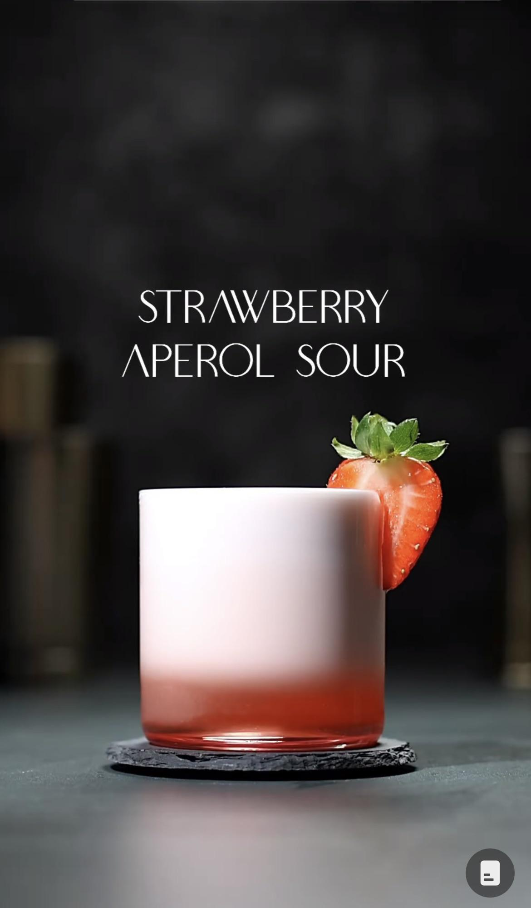

# Strawberry Aperol Sour

## Rating: ★★★★☆
## Difficulty: ★★★★☆

 

 

---

### Ingredients:

* 2oz Gin (Peppery Gin Perferred)
* 3 Strawberries
* 0.5oz Aperol
* 0.5oz Campari
* 0.5oz Lemon Juice
* 0.25oz Agave Nectar
* 1 Egg White
* *(Optional)* Pepper
##
* *(Garnish)* Strawberry
* *(Ice)* None
* *(Glass)* Old Fashioned

---

### Directions:
1. Mudle strawberries in shaker
2. Add all other ingredients
3. Reverse dry shake
4. Double strain into glass
5. *(Optional)* Grind pepper on top
---

#### Notes:
> This is a very interesting drink. I used frozen strawberries and that gave a lot of juice so mine might have been a bit heavy on strawberry. First the color is amazing and if you can get a really good long foam the cocktail really does look amazing. As for flavor the strawberry hits first and its smells like strawberry too, then the aperol and campari come in and give it a nice bitter finish. The pepper finally comes in and combines everything together to leave wth an interesting aftertaste. Very refresing and a fun drink to work through. Adding the pepper is only needed if you don't have peppery gin.

---

### Source:
* [Gintensiv Instagram](https://vm.tiktok.com/ZGJHPvdjY/)