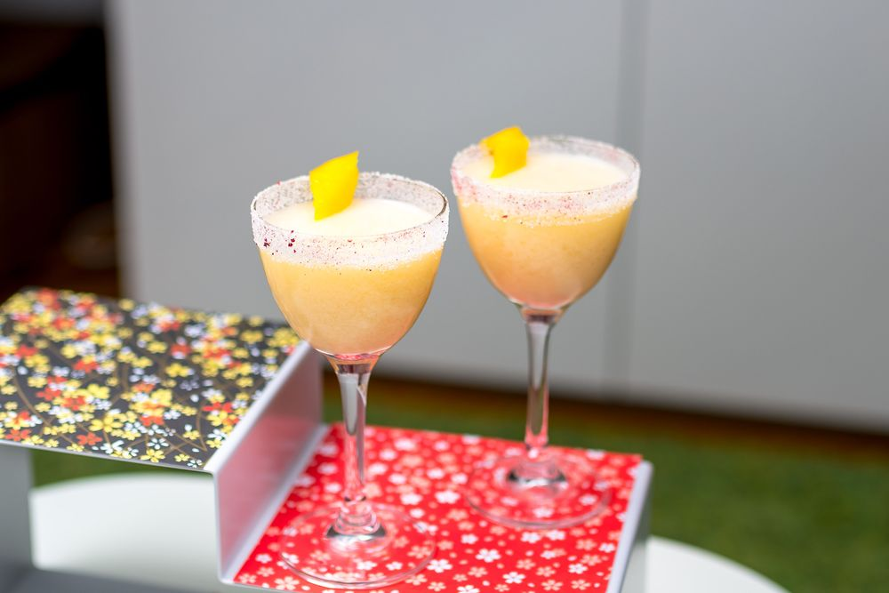

# Drink Name Here

## Rating: ★★★☆☆
## Difficulty: ★★★☆☆

 

 

---

### Ingredients:

* 1oz Cognac
* 0.5oz Old Tom Gin
* 0.75oz Lemon Juice
* 0.5oz Orgeat
* 0.25oz Maraschino Liqueur
##
* *(Garnish)* Lemon Twist and Sugar Rim
* *(Ice)* None
* *(Glass)* Nic and Nora

---

### Directions:
1. Shake all ingredients with ice
2. Strain into glass with sugar rim
3. Garnish with lemon twist
---

#### Notes:
> It's an interesting cocktail that I'm not sure how I feel about. It has a lot of interesting flavors and a color I don't love but it's absolutely not bad. I think it's worth trying but I'm not really going out of my way to make it. I also need to try it with genuine old tom gin. 

---

### Source:
* *I'm Just Here for the Drinks* by Sother Teague (Page 236)