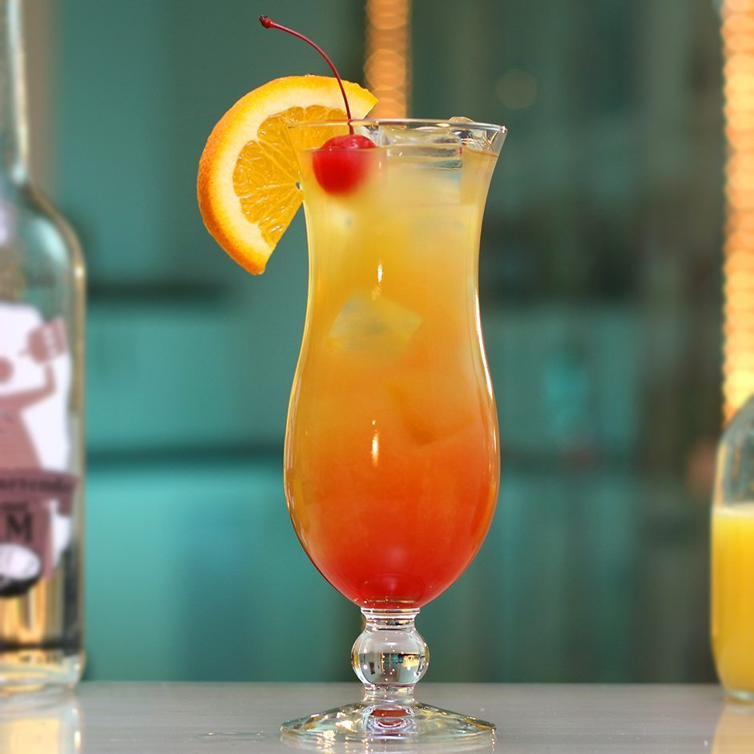

# Bahama Mama

## Rating: ★★★★☆
## Difficulty: ★★★☆☆

 

 

---

### Ingredients:

* 1oz Coconut Rum
* 1oz Dark Overproof Rum
* 0.5oz Coffee Liqueur
* 2.5oz Pineapple Juice
* 0.75oz Lemon Juice
##
* *(Garnish)* Cherry / Pineapple Wedge
* *(Ice)* Crushed / Cubed
* *(Glass)* Hurricane / Collins

---

### Directions:
1. Add all ingredients to a shaker with ice and shake well.
2. Strain into a glass with ice.
3. Garnish with a cherry and pineapple wedge.
---

#### Notes:
> This is a summer interesting Rum cocktail. It's sweet and tastes like pineapple but the overproof dark rum and coffee liquor add a lot of complexity and flavor to the drink!

---

### Source:
* [Liquor.com](https://www.liquor.com/bahama-mama-cocktail-recipe-5186044)