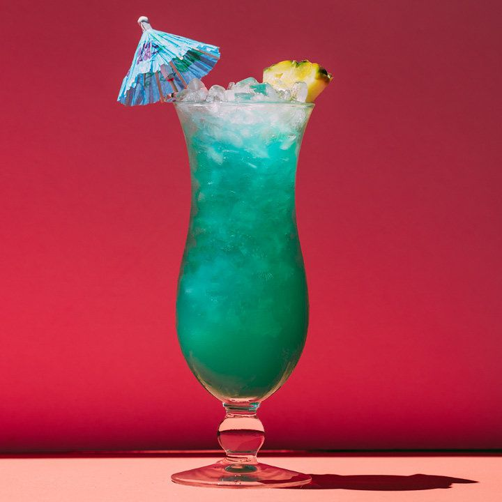

# Blue Hawiian

## Rating: ★★★★★
## Difficulty: ★★☆☆☆

 

 

---

### Ingredients:

* 1oz White Rum
* 1oz Blue Curacao
* 1oz Coconut Cream
* 3oz Pineapple Juice
##
* *(Garnish)* Pineapple Wedge / Umbrella / Cherry
* *(Ice)* Crushed
* *(Glass)* Hurricane

---

### Directions:
1. Add all ingredients to blender or shaker
2. Blend or shake
3. Pour into glass and garnish
---

#### Notes:
> My mom's favorite drink for the most part and loves when I make it for her. It's super tasty, doesn't really taste like liquor and has lots of good coconut and pinapple vibes with a great blue color. It even gets an umbrella and uses a hurricane glass! Can't recommend this one enough for a nice summer drink.

---

### Source:
* [Tipsy Bartender](https://tipsybartender.com/recipe/blue-hawaiian/)