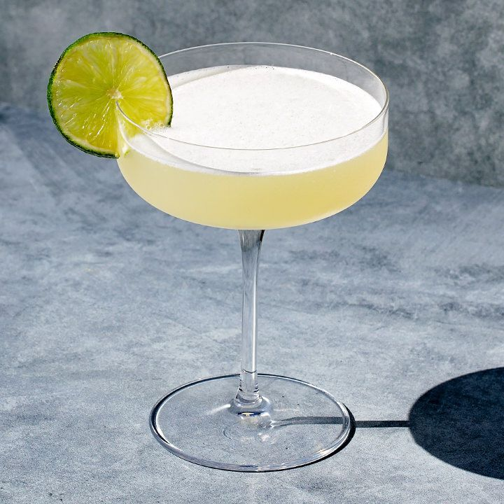

# Daiquiri

## Rating: ★★★★★
## Difficulty: ★★☆☆☆

 

 

---

### Ingredients:

* 2oz White Rum
* 0.75oz Lime Juice
* 0.75oz Simple Syrup
##
* *(Garnish)* Lime Wedge or Wheel
* *(Ice)* None
* *(Glass)* Coupe or Martini

---

### Directions:
1. Shake ingredients with ice
2. Double strain into a chilled coupe or martini glass
3. Garnish with a lime wedge or wheel
---

#### Notes:
> God almighty this drink is just so good. Perfect refreshing drink for a warm day. It's light, the rum (especially a good rum) has that funk, and the sour sweet combo to support the funky rum taste just makes for a drink that I could drink all day long. Super simple and one of my go-to drinks.

---

### Source:
* Sother Teague - *I'm Just Here for the Drinks* (Page 174)