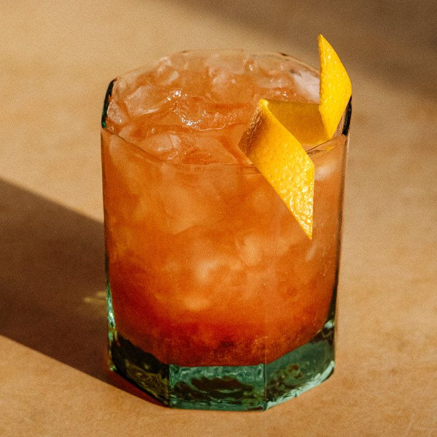

# Grand Slam

## Rating: ★★★☆☆
## Difficulty: ★★☆☆☆

 

 

---

### Ingredients:

* 2oz 7 Year Aged Rum
* 1oz Gosling's Black Seal Rum
* 1oz Lemon Juice
* 0.5oz Pierre Ferrand Dry Curacao
* 0.25oz Grenadine
##
* *(Garnish)* Lemon Wheel / Lemon Twist / Cherry
* *(Ice)* Crushed Ice
* *(Glass)* Old Fashioned

---

### Directions:
1. Shake all ingredients with ice
2. Strain into glass filled with crushed ice
3. Garnish with lemon wheel / lemon twist / cherry
---

#### Notes:
> Ehhh it's fine. It's refreshing and easy to drink but its not super interesting in my opinion. The flavors don't really stand out and it's a litte boring. I think it needs something else to counteract the lemon juice. It's still a fun drink but I wouldn't use good rum on it.

---

### Source:
* [Liquor.com](https://www.liquor.com/grand-slam-cocktail-recipe-5203706)