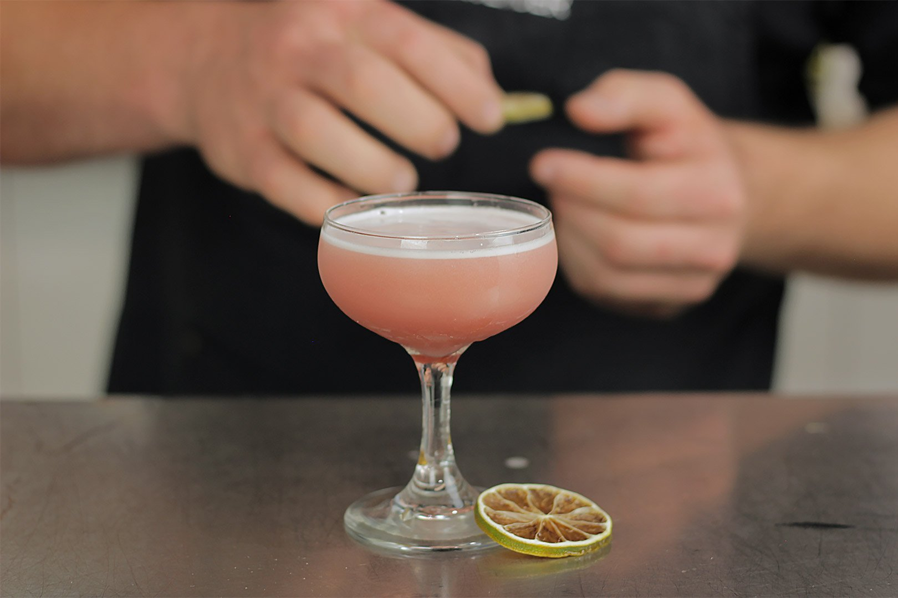

# Hawaiian Sunset

## Rating: ★★★☆☆
## Difficulty: ★★☆☆☆

 

 

---

### Ingredients:

* 1.5oz Vodka
* 0.5oz Lime Juice
* 0.5oz Lemon Juice
* 0.5oz Orgeat
* 1Tsp Grenadine
##
* *(Garnish)* Lime Peel
* *(Ice)* None
* *(Glass)* Chilled Coupe

---

### Directions:
1. Combine all ingredients in a shaker with ice.
2. Shake until chilled.
3. Strain into a chilled coupe.
4. Garnish with a lime peel.
---

#### Notes:
> It's an interesting drink and I'm not sure how I feel about it. It was tasty especially the first few sips but it doesn't have a ton of depth. I don't know if ill be making many more of these but I do love using orgeat.

---

### Source:
* *Smuggler's Cove* by Martin Cate (Page 62)