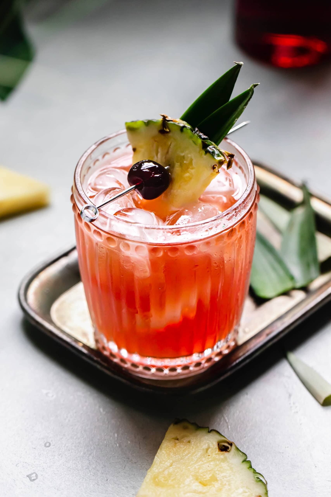

# Jungle Bird

## Rating: ★★★☆☆
## Difficulty: ★★★☆☆

 

 

---

### Ingredients:

* 2oz Dark Jamaican Rum
* 2oz Pineapple Juice
* 0.75oz Campari
* 0.5oz Lime Juice
* 0.5oz Simple Syrup
##
* *(Garnish)* Pineapple Wedge / Leaf / Cherry
* *(Ice)* Crushed / Small Cubes
* *(Glass)* Rocks

---

### Directions:
1. Whip shake all ingredients with ice
2. Dump (no strain) into ice-filled glass
3. Garnish with pineapple wedge / leaf / cherry and serve
---

#### Notes:
> It's an interesting tropical rum drink and not the average one. This one has campari making it more bitter but it also has the simple sour base and some pinapple juice to up the tropical taste. Finally the jamacian rum gives it the signature rum funk that makes it a rum drink. It's a good drink to have on a hot day. Didn't fall in love with it but I think its an acquired taste.

---

### Source:
* [Educated Barfly Youtube](https://youtu.be/AWnIqpsfyPU?t=1132)