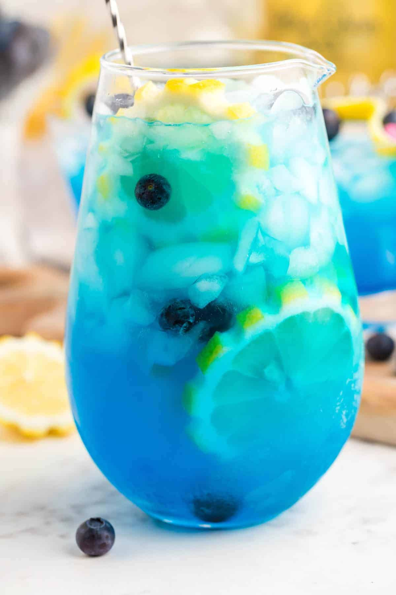

# Ocean Breeze

## Rating: ★★★☆☆
## Difficulty: ★★★☆☆

 

 

---

### Ingredients:

* 0.75oz White Rum
* 0.75oz Amaretto
* 0.5oz Blue Curacao
* 1oz Pineapple Juice
* Splash of Club Soda
##
* *(Garnish)* Cherry / Pineapple Wedge / Lemon Wedge
* *(Ice)* Not Important
* *(Glass)* Highball Glass / Other Smaller Glass

---

### Directions:
1. Shake all ingredients except club soda with ice
2. Strain into a glass with ice
3. Top with a splash of club soda
4. Garnish with a cherry and/or pineapple wedge
---

#### Notes:
> I'm not sure about this drink. It's one that I make and i'm just meh on, where it tastes okay enough for me to drink it but not for me to fall in love. But its a good drink for a hot day and sips for a long time without getting boring. I need to look into alternatives to this recipe because I think there is a lot of potential here that's being missed.

---

### Source:
* *The Art of Mixology* by Food Loves