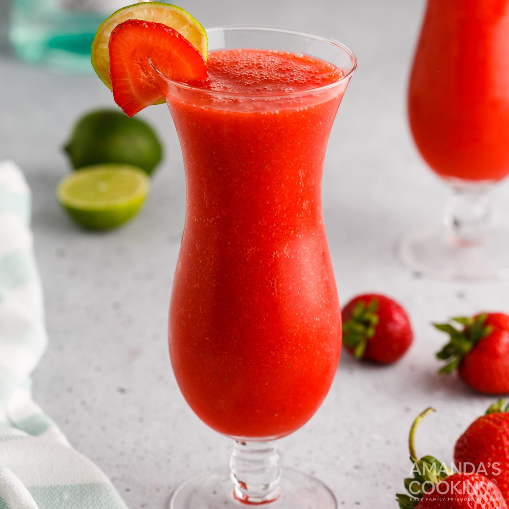

# Strawberry Daiquiri

## Rating: ★★★★★
## Difficulty: ★★★☆☆

 

 

---

### Ingredients:

* 1.5oz Rum
* 1oz Rich Simple Syrup
* 0.75oz Lime Juice
* 4-5 Large Strawberries
* 1 Cup Ice
##
* *(Garnish)* Umbrella / Strawberry / Lime Wheel
* *(Ice)* Blended
* *(Glass)* Hurricane / Margarita / Wine

---

### Directions:
1. Blend all ingredients until smooth
2. Pour into glass
3. Garnish
---

#### Notes:
> Yeah what can I saw except its awesome. It's a daquiri which is already a favorite but now we blend in ice and strawberries to make this drink on a nice summer day a magical experience. Would recommend crushing ice as much as possible before blending however as it can be a bit chunky otherwise.

---

### Source:
* [Liquor.com](https://www.liquor.com/recipes/strawberry-daiquiri/)