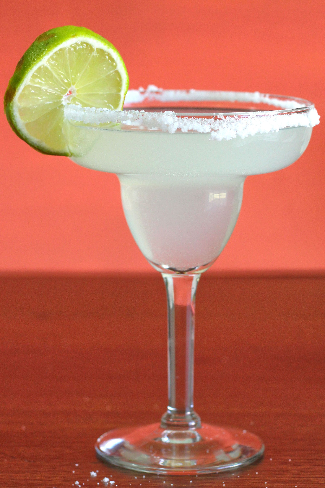

# Margarita

## Rating: ★★☆☆☆
## Difficulty: ★★☆☆☆

 

 

---

### Ingredients:

* 2oz Tequila
* 0.5oz Cointreau
* 1oz Lime Juice
* 0.5oz Agave Syrup
##
* *(Garnish)* Lime Wheel & Salt Rim
* *(Ice)* None
* *(Glass)* Margarita or Similar Glass

---

### Directions:
1. Shake all ingredients with ice
2. Strain into a chilled glass with a salt rim
3. Garnish with a lime wheel
---

#### Notes:
> Yeah I'm not a huge fan since I don't like tequila very much but it's a classic and the first few sips are genuinly good. If you're a tequila fan then absolutely this is an awesome cocktail. However it really does need fresh and quality ingredients since this cocktail is very dependent on their quality since there are only 4 ingredients. 

---

### Source:
* [Liquor.com](https://www.liquor.com/recipes/margarita/)