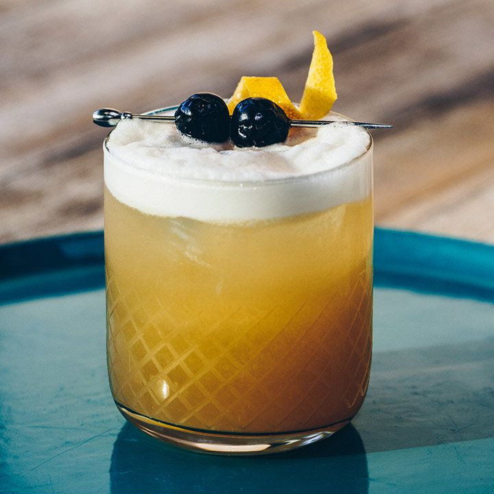

# Amaretto Sour

## Rating: ★★★★★
## Difficulty: ★★★★☆

 

 

---

### Ingredients:

* 1.5oz Amaretto
* 1oz Bourbon
* 1oz Lemon Juice
* 1 Teaspoon Maple Syrup
* 1 Egg White
* 2 Dashes Angostura Bitters
##
* *(Garnish)* Brandied Cherries / Lemon Twist
* *(Ice)* Cubed
* *(Glass)* Rocks

---

### Directions:
1. Add all ingredients to a shaker and dry shake.
2. Add ice and shake again (add strainer spring if you want).
3. Strain into a rocks glass with ice.
4. Let rest for egg white to separate.
5. Paint with ango and garnish.
---

#### Notes:
> Amazing. This is probably one of my favorite drinks of all time. It uses maple syrup for the sweetness which goes perfect with the amaretto and bourbon and the whole thing comes together in a drink that is not super strong, light on the mouth, and just a little sweet. It's fun to garnish with the ango paint and lemon twist and is even a joy to make with the reverse dry shake and egg white!

---

### Source:
* [Liquor.com](https://www.liquor.com/recipes/amaretto-sour/)