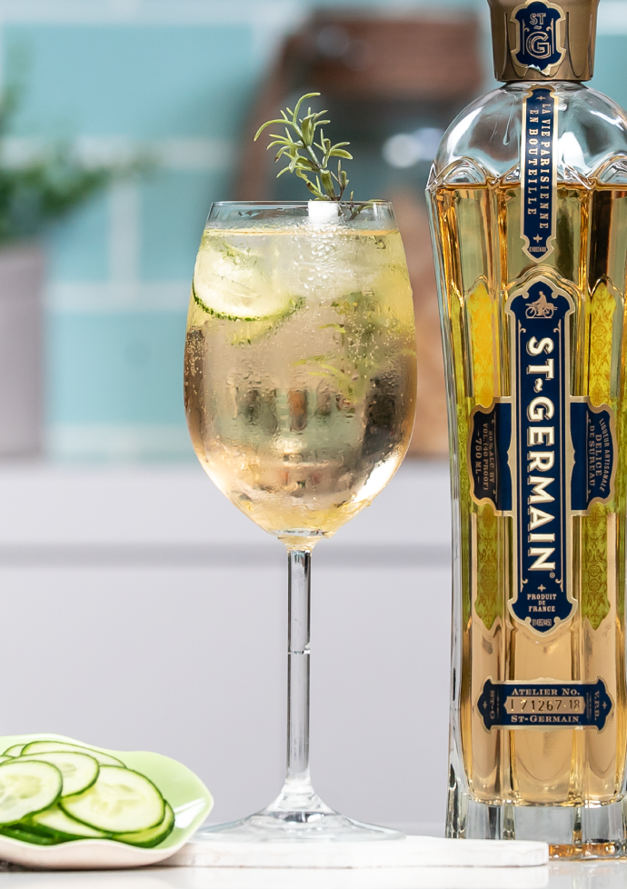

# St. Germain Spritz

## Rating: ★★★★★
## Difficulty: ★☆☆☆☆

 

 

---

### Ingredients:

* 1.5oz Saint Germain
* 2oz Prosecco
* 2oz Club Soda
##
* *(Garnish)* Lemon Twist
* *(Ice)* Crushed
* *(Glass)* Collins?

---

### Directions:
1. Add all ingredients to a glass and enjoy
---

#### Notes:
> It's amazing, way more amazing than I was ready for. It's super refreshing and a great way to enjoy both prosecco and St. Germain and I think lemon twist really brings it together aesthetically. I think mint might also be a great addition to this drink since it looks like it wants something green to the look.

---

### Source:
* Saint Germain Bottle